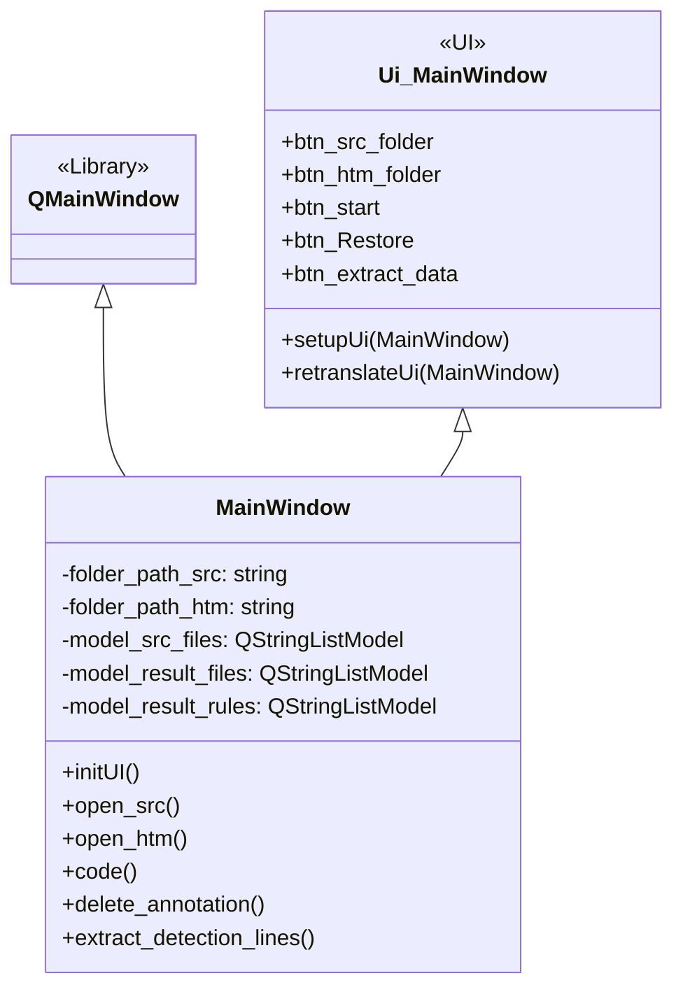
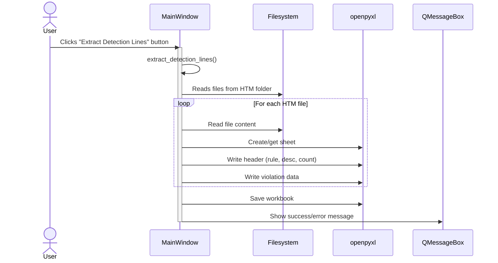
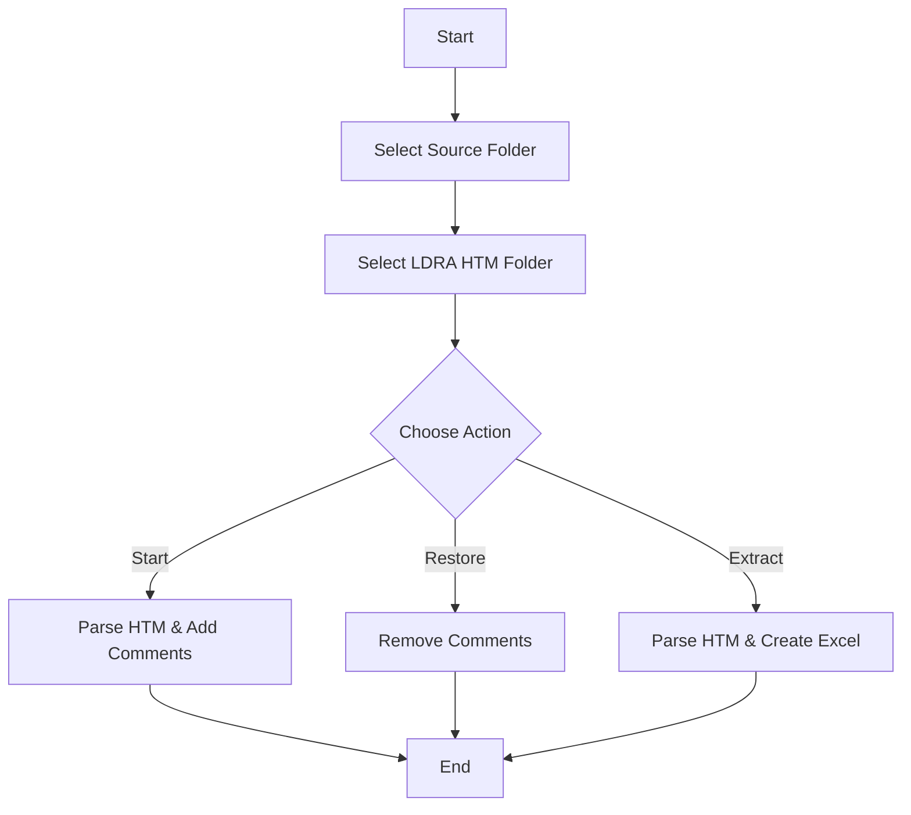

# Code Append - LDRA 사용 설명서

## 1. 프로그램 개요
"Code Append - LDRA"는 LDRA 테스트 결과로 생성된 HTML 보고서에서 코드 위반 사항을 추출하고, 해당 정보를 Excel 파일로 정리하며, 필요에 따라 소스 코드에 주석을 추가하거나 제거하는 도구입니다.

## 2. 개발 환경 설정
### 가상 환경 활성화
프로그램 실행을 위한 가상 환경을 활성화합니다.
```bash
.\ldra_static\Scripts\Activate.ps1
```

### 의존성 설치
`requirements.txt`에 명시된 파이썬 패키지들을 설치합니다.
```bash
pip install -r requirements.txt
```

## 3. 실행 파일(.exe) 생성
다음 명령어를 사용하여 실행 파일을 생성할 수 있습니다.
```bash
pyinstaller --onefile --noconsole --hidden-import=openpyxl code_append.py 
```

## 4. 프로그램 사용법

### 4.1. 폴더 선택 및 설정

*   **소스코드 폴더 열기 (btn_src_folder)**
    *   **기능**: 분석 대상 소스 코드 파일(.cpp, .hpp 등)이 있는 폴더를 선택합니다.
    *   **표시**: `label_src_folder_path`에 선택된 폴더의 경로가 표시됩니다.
    *   **결과**: `listView_src_files`에 선택된 폴더 내의 소스 파일 목록이 표시됩니다.

*   **LDRA htm 폴더 열기 (btn_htm_folder)**
    *   **기능**: LDRA 분석 결과로 생성된 HTML 보고서(.htm 파일)들이 있는 폴더를 선택합니다.
    *   **표시**: `label_htm_folder_path`에 선택된 폴더의 경로가 표시됩니다.
    *   **결과**: `listView_result_files`에 LDRA htm 폴더에서 검출된 파일 목록이 표시됩니다.

*   **Stage (comboBox_Stage)**
    *   **기능**: 현재 작업 단계를 선택합니다. (예: `DT`, `OT`)
    *   **영향**: 소스 코드에 주석을 추가하거나 제거할 때 사용되는 주석 형식에 영향을 줍니다.

*   **Rule (comboBox_Rule)**
    *   **기능**: 적용할 룰 셋을 선택합니다. (예: `MISRA`, `CWE`)
    *   **영향**: 소스 코드에 주석을 추가하거나 제거할 때 사용되는 주석 형식에 영향을 줍니다.

### 4.2. 기능 버튼

*   **시작 (btn_start)**
    *   **기능**: 선택된 소스 코드 폴더와 LDRA htm 폴더를 기반으로 코드 분석 및 주석 추가 작업을 시작합니다.
    *   **작동 방식**:
        1.  LDRA htm 파일에서 룰 위반 정보를 추출합니다.
        2.  추출된 정보를 바탕으로 룰 별 검출 개수 및 파일 별 검출 내용을 정리합니다.
        3.  선택된 소스 코드 파일에 추출된 룰 위반 정보를 주석 형태로 추가합니다. (예: `/*DT_MISRA_139S*/`)
    *   **표시**: `label_Status`에 현재 작업 상태가 표시되고, `label_Result`에 작업 완료 메시지가 표시됩니다.
    *   **결과**: `listView_result_rules`에 룰 별 검출 개수가 표시되고, `treeWidget_result`에 파일 별 검출 내용이 트리 형태로 표시됩니다.

*   **Restore (btn_Restore)**
    *   **기능**: `시작` 버튼으로 추가된 주석을 소스 코드에서 제거하고 원본 상태로 복원합니다.
    *   **표시**: `label_Status`에 현재 작업 상태가 표시되고, `label_Result`에 작업 완료 메시지가 표시됩니다.

*   **Extract Detection Lines (btn_extract_data)**
    *   **기능**: LDRA htm 폴더의 내용을 분석하여 위반 사항을 Excel 파일로 추출합니다.
    *   **출력 파일**: `[LDRA htm 폴더 이름]_extract.xlsx` 형식의 Excel 파일이 LDRA htm 폴더와 동일한 위치에 생성됩니다.
    *   **Excel 파일 형식**:
        *   각 LDRA 검출 룰 별로 별도의 시트가 생성됩니다.
        *   **시트 첫 번째 행, 첫 번째 열**: `[룰 이름]` (예: `139 S`)
        *   **시트 첫 번째 행, 두 번째 열**: `[룰 설명]` (예: `Construct leads to infeasible code`)
        *   **시트 첫 번째 행, 세 번째 열**: 해당 룰의 총 검출 개수
        *   **시트 두 번째 행부터**: 각 위반 사항의 위치 정보가 두 개의 열로 나뉘어 기록됩니다.
            *   첫 번째 열: 함수명 또는 파일명 (예: `nsSDI::StartTask`, `CMsg.hpp`)
            *   두 번째 열: 라인 번호 (예: `279`) 또는 "Reference to function location" (라인 정보가 없는 경우)
        *   **특수 룰 처리**:
            *   `45D, 128D, 70D, 91D, 3X` 룰: 첫 번째 검출 라인만 기록합니다.
            *   `49D, 68X` 룰: 마지막 검출 라인만 기록합니다.
            *   `38S` 룰 ("Whole program" 관련): 함수명 대신 파일명을 사용하고 라인 번호를 함께 기록합니다.
    *   **경고**: LDRA htm 폴더가 선택되지 않은 경우 경고 메시지가 표시됩니다.
    *   **정보**: 추출할 유효한 htm 파일이 없는 경우, "No Data" 시트가 포함된 빈 Excel 파일이 생성됩니다.

### 4.3. 정보 표시 위젯

*   **검출대상 파일(소스코드) (listView_src_files)**
    *   선택된 소스 코드 폴더 내의 파일 목록을 표시합니다.

*   **검출된 파일 리스트 (listView_result_files)**
    *   LDRA htm 폴더에서 분석된 파일 목록을 표시합니다.

*   **Rule 별 검출 개수 (listView_result_rules)**
    *   각 룰 별로 검출된 위반 사항의 총 개수를 표시합니다.

*   **선택된 파일의 검출내용 (treeWidget_result)**
    *   `listView_result_files`에서 선택된 파일에 대한 상세 검출 내용을 트리 형태로 표시합니다.

---

## 5. 다이어그램

### 5.1. 클래스 다이어그램 (Class Diagram)


### 5.2. 시퀀스 다이어그램 (Sequence Diagram) - "Extract Detection Lines"


### 5.3. 플로우차트 (Flowchart)


---
**주의**: 이 문서는 프로그램의 현재 버전을 기준으로 작성되었습니다. 기능 변경 시 업데이트될 수 있습니다.